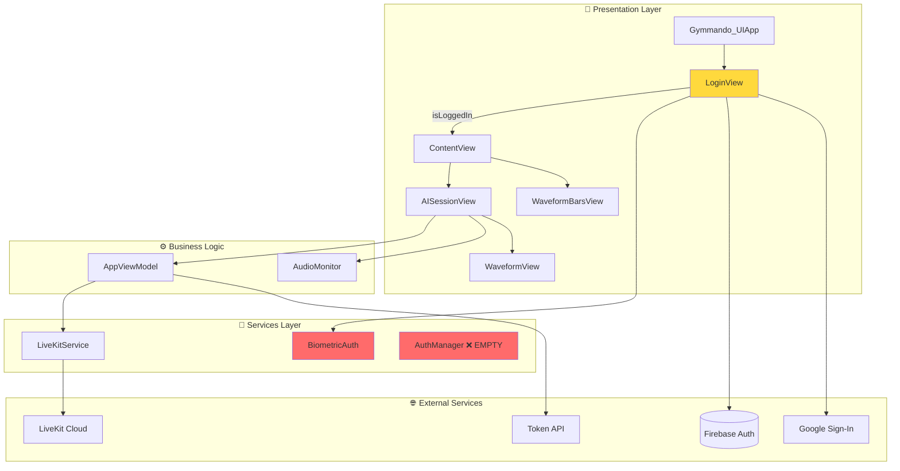
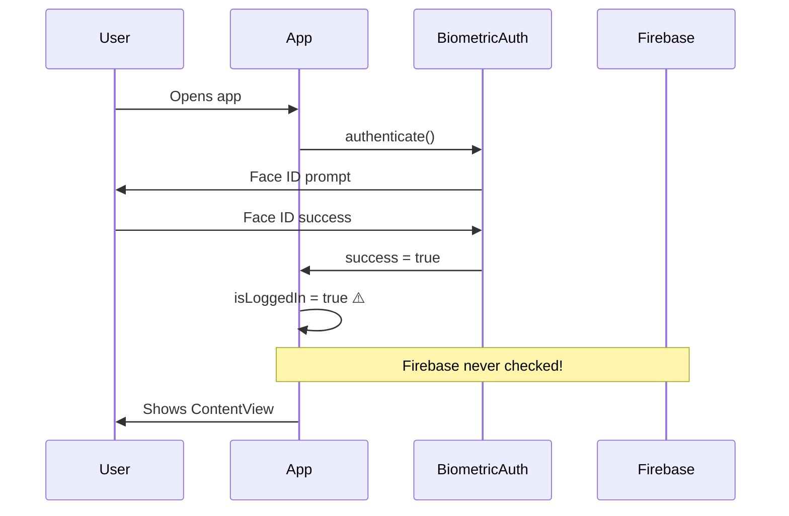
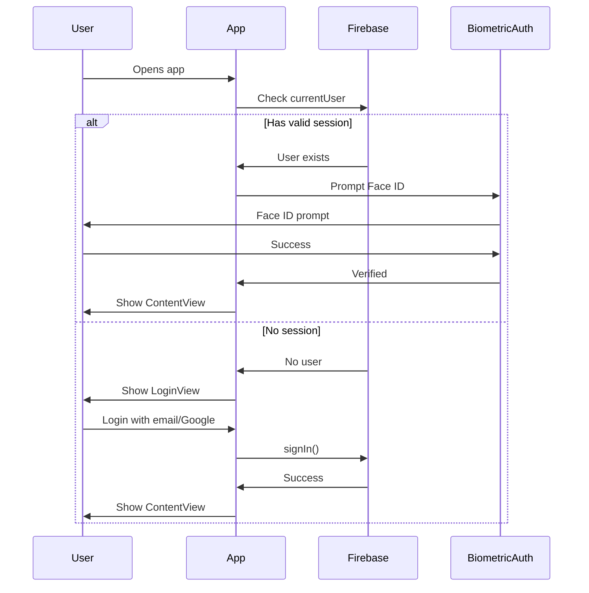
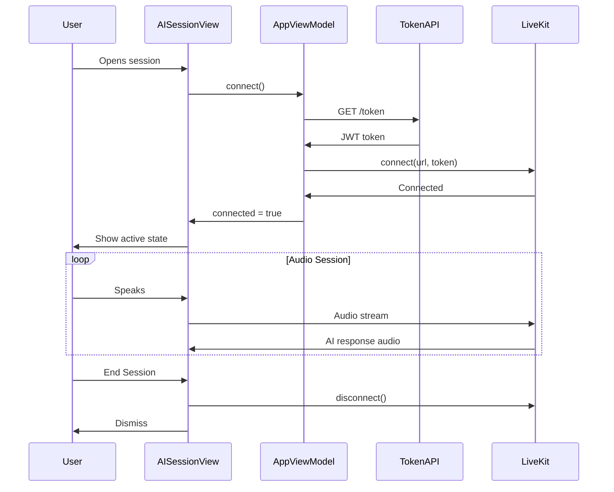

# 🏗️ Gymmando — Complete Codebase Analysis & Improvement Blueprint

> **Generated:** December 28, 2025
> **Platform:** Swift/SwiftUI (iOS 16.4+)
> **Health Score:** 35/100 🔴
> **Critical Issues:** 12
> **High Priority Issues:** 18
> **Medium Priority Issues:** 24

---

## 📋 Executive Summary

**Gymmando** is an iOS voice-based AI gym assistant using LiveKit for real-time audio communication. The app allows users to authenticate via Firebase (Email/Password, Google Sign-In, or Biometrics) and connect to an AI voice assistant for workout guidance.

### Overall Assessment

The codebase is in **early development stage** with significant architectural, security, and UX issues that must be addressed before production release:

1. **🔴 CRITICAL SECURITY FLAW:** Biometric authentication bypasses Firebase entirely — users can gain access without valid credentials by simply passing Face ID, even if they've never logged in or their session expired.

2. **🔴 Architecture Debt:** No proper state management, hardcoded URLs, empty placeholder files, components mixed in view files, no dependency injection, deprecated APIs.

3. **🔴 UI/UX Gaps:** No loading states, error states, empty states, onboarding, logout functionality, accessibility support, or proper animations.

4. **🔴 Missing Critical Features:** No logout, no profile/settings, no subscription/paywall, no analytics, no crash reporting.

### Top 5 Priorities (Fix Immediately)

| Priority | Issue | Impact | Effort |
|----------|-------|--------|--------|
| P0 | Biometric auth bypasses Firebase | Users access app without valid auth | 2h |
| P0 | No logout functionality | Users cannot sign out | 1h |
| P0 | No error handling UI | Users see blank screens on failure | 3h |
| P1 | Hardcoded API URLs | Cannot switch environments | 1h |
| P1 | Memory leaks in animations | App crashes over time | 2h |

---

## 🗂️ Project Structure Analysis

### Current File Tree
```
gymmando-ui/
├── .git/
├── .gitignore
├── LICENSE
├── README.md
├── artifacts/
│   └── logo.jpeg
├── Gymmando-UI.xcodeproj/
│   ├── project.pbxproj
│   └── ...
└── Gymmando-UI/
    ├── Info.plist
    ├── GoogleService-Info.plist
    ├── GoogleService-Info (4).plist          ⚠️ Duplicate config
    ├── App/
    │   └── Gymmando_UIApp.swift              ✅ Entry point
    ├── Views/
    │   ├── ContentView.swift                  🟡 Main home screen
    │   ├── LoginView.swift                    🔴 Security issues
    │   ├── AISessionView.swift                🟡 Mixed components
    │   └── CameraView.swift                   ❌ EMPTY FILE
    ├── ViewModels/
    │   └── AppViewModel.swift                 🔴 Hardcoded URLs
    ├── Services/
    │   ├── LiveKitService.swift               🟡 Needs improvement
    │   ├── BiometricAuth.swift                🔴 Security flaw
    │   ├── AuthManager.swift                  ❌ EMPTY FILE
    │   └── FaceRecognitionService.swift       ❌ EMPTY FILE
    ├── Models/                                ❌ EMPTY FOLDER
    ├── Utilities/                             ❌ EMPTY FOLDER
    ├── Assets.xcassets/
    │   ├── AppIcon.appiconset/
    │   ├── AccentColor.colorset/              ⚠️ No color defined
    │   └── AppLogo.imageset/
    └── Preview Content/
```

### Architecture Diagram



### Recommended Structure
```
Gymmando-UI/
├── App/
│   ├── Gymmando_UIApp.swift
│   ├── AppDelegate.swift                    # Firebase, lifecycle
│   └── Environment.swift                    # Dev/Staging/Prod config
├── Core/
│   ├── Design/
│   │   ├── DesignTokens.swift              # Colors, spacing, typography
│   │   ├── Theme.swift                      # Theme management
│   │   └── Haptics.swift                    # Haptic feedback
│   ├── Extensions/
│   │   ├── View+Extensions.swift
│   │   └── Color+Extensions.swift
│   └── Utilities/
│       ├── Logger.swift
│       └── Constants.swift
├── Features/
│   ├── Authentication/
│   │   ├── Views/
│   │   │   ├── LoginView.swift
│   │   │   ├── OnboardingView.swift
│   │   │   └── Components/
│   │   ├── ViewModels/
│   │   │   └── AuthViewModel.swift
│   │   └── Services/
│   │       ├── AuthService.swift
│   │       └── BiometricService.swift
│   ├── Home/
│   │   ├── Views/
│   │   │   └── HomeView.swift
│   │   └── ViewModels/
│   │       └── HomeViewModel.swift
│   ├── AISession/
│   │   ├── Views/
│   │   │   ├── AISessionView.swift
│   │   │   └── Components/
│   │   │       ├── WaveformView.swift
│   │   │       └── AudioVisualizerView.swift
│   │   ├── ViewModels/
│   │   │   └── AISessionViewModel.swift
│   │   └── Services/
│   │       ├── LiveKitService.swift
│   │       └── AudioMonitor.swift
│   ├── Profile/
│   │   └── ...
│   └── Settings/
│       └── ...
├── Services/
│   ├── Network/
│   │   ├── APIClient.swift
│   │   └── Endpoints.swift
│   └── Analytics/
│       └── AnalyticsService.swift
└── Resources/
    ├── Assets.xcassets
    └── Localizable.strings
```

---

## 📁 File-by-File Analysis

### 1. Gymmando_UIApp.swift
**Path:** `Gymmando-UI/App/Gymmando_UIApp.swift`
**Purpose:** App entry point, Firebase configuration
**Health:** 🟡 Needs Work

**Current Implementation:**
```swift
@main
struct Gymmando_UIApp: App {
    init() {
        FirebaseApp.configure()
    }

    var body: some Scene {
        WindowGroup {
            LoginView()
                .onOpenURL { url in
                    GIDSignIn.sharedInstance.handle(url)
                }
        }
    }
}
```

**Issues Found:**
| # | Issue | Severity | Line |
|---|-------|----------|------|
| 1 | No authentication state observation | 🔴 Critical | L18-20 |
| 2 | No proper app lifecycle handling | 🟡 Medium | - |
| 3 | No @UIApplicationDelegateAdaptor for push notifications | 🟡 Medium | - |
| 4 | No environment object injection | 🟡 Medium | - |

**Recommended Fix:**
```swift
import SwiftUI
import FirebaseCore
import FirebaseAuth
import GoogleSignIn

@main
struct Gymmando_UIApp: App {
    @UIApplicationDelegateAdaptor(AppDelegate.self) var delegate
    @StateObject private var authViewModel = AuthViewModel()

    var body: some Scene {
        WindowGroup {
            RootView()
                .environmentObject(authViewModel)
                .onOpenURL { url in
                    GIDSignIn.sharedInstance.handle(url)
                }
        }
    }
}

class AppDelegate: NSObject, UIApplicationDelegate {
    func application(_ application: UIApplication,
                     didFinishLaunchingWithOptions launchOptions: [UIApplication.LaunchOptionsKey: Any]?) -> Bool {
        FirebaseApp.configure()
        return true
    }
}

struct RootView: View {
    @EnvironmentObject var authViewModel: AuthViewModel

    var body: some View {
        Group {
            switch authViewModel.authState {
            case .loading:
                SplashView()
            case .unauthenticated:
                LoginView()
            case .authenticated:
                ContentView()
            }
        }
        .animation(.easeInOut(duration: 0.3), value: authViewModel.authState)
    }
}
```

---

### 2. LoginView.swift
**Path:** `Gymmando-UI/Views/LoginView.swift`
**Purpose:** User authentication (Email, Google, Biometric)
**Health:** 🔴 Critical Issues

**Issues Found:**
| # | Issue | Severity | Line |
|---|-------|----------|------|
| 1 | 🔴 **CRITICAL:** BiometricAuth bypasses Firebase entirely | 🔴 Critical | L89-97 |
| 2 | No input validation (email format, password strength) | 🔴 Critical | L44-46 |
| 3 | No loading state during authentication | 🟡 Medium | - |
| 4 | Using deprecated `autocapitalization` | 🟢 Low | L32 |
| 5 | Error message not cleared between attempts | 🟡 Medium | - |
| 6 | No keyboard dismissal handling | 🟡 Medium | - |
| 7 | No password visibility toggle | 🟡 Medium | L35 |
| 8 | No "Forgot Password" functionality | 🟡 Medium | - |
| 9 | White background jarring against dark ContentView | 🟡 Medium | - |
| 10 | No haptic feedback on actions | 🟢 Low | - |

**CRITICAL SECURITY FLAW EXPLAINED:**
```swift
// CURRENT (BROKEN) - Line 89-97
func authenticateWithBiometric() {
    BiometricAuth.shared.authenticate { success, error in
        if success {
            isLoggedIn = true  // ⚠️ SETS LOGGED IN WITHOUT CHECKING FIREBASE!
        } else {
            errorMessage = "Authentication failed"
        }
    }
}
```

This allows ANYONE to access the app by:
1. Opening app fresh (no Firebase session)
2. Passing Face ID (which only verifies device ownership)
3. `isLoggedIn = true` grants access without any backend auth

**Proper Flow Should Be:**
```
User Opens App
    ↓
Check Firebase Auth State
    ↓
If Logged In Previously → Prompt Biometric → If Pass → Show Content
                                            → If Fail → Show Login Form
If Not Logged In → Show Login Form → After Success → Enable Biometric for Next Time
```

---

### 3. ContentView.swift
**Path:** `Gymmando-UI/Views/ContentView.swift`
**Purpose:** Main home screen after login
**Health:** 🟡 Needs Work

**Issues Found:**
| # | Issue | Severity | Line |
|---|-------|----------|------|
| 1 | No logout button anywhere | 🔴 Critical | - |
| 2 | WaveformBarsView uses Timer causing memory leak | 🔴 Critical | L103-109 |
| 3 | Timer not invalidated on view disappear | 🔴 Critical | L103 |
| 4 | Magic numbers for spacing/sizing | 🟡 Medium | L17,30,31,58,59 |
| 5 | No pull-to-refresh or loading states | 🟡 Medium | - |
| 6 | No accessibility labels | 🟡 Medium | - |
| 7 | Button lacks haptic feedback | 🟢 Low | L36 |

**Memory Leak in WaveformBarsView:**
```swift
// CURRENT (LEAKING)
.onAppear {
    Timer.scheduledTimer(withTimeInterval: 0.6, repeats: true) { _ in
        // Timer never invalidated!
        withAnimation {
            for i in 0..<heights.count {
                heights[i] = CGFloat.random(in: 20...40)
            }
        }
    }
}
```

---

### 4. AISessionView.swift
**Path:** `Gymmando-UI/Views/AISessionView.swift`
**Purpose:** Live AI voice session with visualizations
**Health:** 🟡 Needs Work

**Issues Found:**
| # | Issue | Severity | Line |
|---|-------|----------|------|
| 1 | AudioMonitor class mixed in view file | 🟡 Medium | L275-314 |
| 2 | WaveformView/BarWithTrailView in same file | 🟡 Medium | L173-272 |
| 3 | Using deprecated `onChange` API (iOS 17+) | 🟡 Medium | L262 |
| 4 | No error UI if connection fails | 🔴 Critical | - |
| 5 | No retry mechanism for failed connections | 🟡 Medium | - |
| 6 | No timeout handling | 🟡 Medium | - |
| 7 | Pulse animation uses deprecated pattern | 🟢 Low | L38-51 |
| 8 | AudioMonitor doesn't handle interruptions | 🟡 Medium | - |
| 9 | No haptic feedback for connection states | 🟢 Low | - |
| 10 | "Connecting..." shown even when already connected | 🟡 Medium | L94-98 |

**Deprecated onChange API:**
```swift
// CURRENT (Deprecated in iOS 17)
.onChange(of: audioLevel) { newValue in
    // ...
}

// SHOULD BE (iOS 17+)
.onChange(of: audioLevel) { oldValue, newValue in
    // ...
}
```

---

### 5. AppViewModel.swift
**Path:** `Gymmando-UI/ViewModels/AppViewModel.swift`
**Purpose:** Main app state and LiveKit connection
**Health:** 🔴 Critical Issues

**Issues Found:**
| # | Issue | Severity | Line |
|---|-------|----------|------|
| 1 | Hardcoded API URL | 🔴 Critical | L14 |
| 2 | Hardcoded LiveKit WebSocket URL | 🔴 Critical | L31 |
| 3 | Debug print statements in production code | 🟡 Medium | L8,19,29 |
| 4 | No proper error types/handling | 🟡 Medium | L34-36 |
| 5 | Room name hardcoded | 🟡 Medium | L12 |
| 6 | No retry logic for network failures | 🟡 Medium | - |
| 7 | Token has no expiry handling | 🟡 Medium | - |

**Hardcoded URLs (Security/Deployment Issue):**
```swift
// CURRENT (DANGEROUS)
guard let tokenURL = URL(string: "https://gymmando-api-cjpxcek7oa-uc.a.run.app/token") else {
let url = "wss://gymbo-li7l0in9.livekit.cloud"
```

---

### 6. LiveKitService.swift
**Path:** `Gymmando-UI/Services/LiveKitService.swift`
**Purpose:** WebRTC connection via LiveKit SDK
**Health:** 🟡 Needs Work

**Issues Found:**
| # | Issue | Severity | Line |
|---|-------|----------|------|
| 1 | Timer-based audio monitoring (inefficient) | 🟡 Medium | L81-86 |
| 2 | Debug print statements everywhere | 🟡 Medium | L16-20 |
| 3 | No delegate pattern for room events | 🟡 Medium | - |
| 4 | Audio session not reset on disconnect | 🟡 Medium | L59-78 |
| 5 | No reconnection logic | 🔴 Critical | - |
| 6 | No network reachability handling | 🟡 Medium | - |

---

### 7. BiometricAuth.swift
**Path:** `Gymmando-UI/Services/BiometricAuth.swift`
**Purpose:** Face ID / Touch ID authentication
**Health:** 🔴 Critical Issues

**Issues Found:**
| # | Issue | Severity | Line |
|---|-------|----------|------|
| 1 | 🔴 **No integration with Firebase session** | 🔴 Critical | ALL |
| 2 | No check if user was previously authenticated | 🔴 Critical | - |
| 3 | Completion handler on wrong thread risk | 🟡 Medium | L14-24 |

**The Problem:**
BiometricAuth only verifies device ownership, not app authentication. It should:
1. Check if a valid Firebase session exists
2. Only allow biometric unlock if session is valid
3. Refresh token if needed

---

### 8-10. Empty Files
**Files:** `AuthManager.swift`, `CameraView.swift`, `FaceRecognitionService.swift`
**Health:** ❌ Dead Code

These files are empty and should be removed or implemented. They're referenced in the project but serve no purpose.

---

## 🚨 Critical Issues (P0 — Fix Immediately)

### Issue 1: Biometric Authentication Bypasses Firebase
**Files Affected:** `LoginView.swift`, `BiometricAuth.swift`
**Impact:** Users can access app without valid authentication
**Root Cause:** BiometricAuth.authenticate() sets isLoggedIn=true without verifying Firebase session

### Issue 2: No Logout Functionality
**Files Affected:** `ContentView.swift`, `LoginView.swift`
**Impact:** Users cannot sign out, data may persist incorrectly

### Issue 3: Memory Leaks from Timer-based Animations
**Files Affected:** `ContentView.swift` (WaveformBarsView)
**Impact:** App memory grows over time, potential crash

### Issue 4: No Error UI for Connection Failures
**Files Affected:** `AISessionView.swift`, `AppViewModel.swift`
**Impact:** Users see blank/stuck screens when API fails

### Issue 5: Hardcoded API URLs
**Files Affected:** `AppViewModel.swift`
**Impact:** Cannot switch between dev/staging/prod environments

---

## 🎨 UI/UX Excellence Audit

### Design System Assessment

| Element | Status | Issues |
|---------|--------|--------|
| Spacing System | 🔴 Missing | Magic numbers everywhere (20, 40, 60, etc.) |
| Typography Scale | 🔴 Missing | Inline font definitions, no hierarchy |
| Color System | 🔴 Missing | Hardcoded colors, no semantic naming |
| Border Radius | 🟡 Inconsistent | 16, 25, 2 used without system |
| Shadows/Elevation | 🟡 Basic | Only in AISessionView |
| Animation Tokens | 🔴 Missing | Hardcoded durations everywhere |
| Haptic Feedback | 🔴 None | No haptics on any interaction |

### Missing UI States

| Screen | Loading | Error | Empty | Success |
|--------|---------|-------|-------|---------|
| LoginView | ❌ | 🟡 Text only | N/A | ❌ |
| ContentView | ❌ | ❌ | ❌ | N/A |
| AISessionView | 🟡 Basic | ❌ | N/A | ❌ |

### Accessibility Audit

| Requirement | Status |
|-------------|--------|
| VoiceOver Labels | ❌ Missing |
| Dynamic Type | ❌ Not tested |
| Color Contrast | 🟡 Needs review |
| Touch Targets (44pt) | 🟡 Some too small |
| Reduce Motion | ❌ Not respected |

---

## 🔄 Data Flow Diagrams

### Current Authentication Flow (BROKEN)


### Correct Authentication Flow (SHOULD BE)


### AI Session Flow


---

## 📊 Code Quality Metrics

| Metric | Current | Target | Status |
|--------|---------|--------|--------|
| Empty Files | 3 | 0 | 🔴 |
| Hardcoded URLs | 2 | 0 | 🔴 |
| Debug Print Statements | 25+ | 0 in prod | 🔴 |
| Memory Leaks | 2 known | 0 | 🔴 |
| Deprecated APIs | 2 | 0 | 🟡 |
| Missing Error Handling | 8 cases | 0 | 🔴 |
| Test Coverage | 0% | >70% | 🔴 |
| Accessibility Labels | 0 | 100% | 🔴 |

---

## 💰 RevenueCat Integration Blueprint

### Current Status: ❌ Not Integrated

The app has no monetization. For a fitness AI assistant, subscription model is ideal.

### Recommended Implementation

```swift
// 1. Install via SPM: https://github.com/RevenueCat/purchases-ios

// 2. Configure in AppDelegate
import RevenueCat

Purchases.logLevel = .debug
Purchases.configure(withAPIKey: "your_api_key")

// 3. Identify user after Firebase auth
if let user = Auth.auth().currentUser {
    Purchases.shared.logIn(user.uid) { customerInfo, created, error in
        // Handle subscription state
    }
}
```

---

## 📱 Platform-Specific Checklist

### iOS Requirements
- [x] iOS 16.4+ deployment target
- [ ] Swift 6 strict concurrency ❌ (Using Swift 5)
- [ ] @Observable macro ❌ (Using @ObservableObject)
- [ ] Privacy manifest (PrivacyInfo.xcprivacy) ❌
- [x] Face ID usage description
- [x] Microphone usage description
- [x] Camera usage description
- [ ] Dynamic Type support ❌
- [ ] Dark mode tested ❌
- [ ] Haptic feedback ❌
- [ ] VoiceOver support ❌

---

## 🚀 Implementation Roadmap

### Phase 1: Critical Security & Stability
| Task | Files | Priority |
|------|-------|----------|
| Fix biometric auth to require Firebase session | BiometricAuth, LoginView | P0 |
| Add logout functionality | ContentView, new SettingsView | P0 |
| Fix Timer memory leak | ContentView | P0 |
| Add error states to AISessionView | AISessionView | P0 |
| Create Environment configuration | New file | P0 |

### Phase 2: Architecture & Code Quality
| Task | Files | Priority |
|------|-------|----------|
| Create AuthViewModel with proper state | New file | P1 |
| Extract components from AISessionView | New files | P1 |
| Remove empty files | AuthManager, CameraView, FaceRecognition | P1 |
| Create DesignTokens | New file | P1 |
| Add proper logging (remove prints) | All files | P1 |

### Phase 3: UI/UX Polish
| Task | Files | Priority |
|------|-------|----------|
| Add loading states everywhere | All views | P2 |
| Implement design system | All views | P2 |
| Add haptic feedback | All interactive elements | P2 |
| Add accessibility labels | All views | P2 |
| Create onboarding flow | New files | P2 |

### Phase 4: Features & Monetization
| Task | Files | Priority |
|------|-------|----------|
| Integrate RevenueCat | New files | P2 |
| Add analytics (Mixpanel/Amplitude) | New files | P2 |
| Add crash reporting (Sentry) | New file | P2 |
| Create Settings screen | New file | P2 |
| Create Profile screen | New file | P3 |

---

## ✅ Production Readiness Checklist

### App Store Requirements
- [x] App icon configured
- [ ] Launch screen designed ❌ (Using default)
- [ ] Privacy policy URL ❌
- [ ] Terms of service URL ❌
- [ ] App Store screenshots ❌
- [ ] App Store description ❌

### Technical Requirements
- [ ] No crashes on launch ⚠️ (Untested)
- [ ] No memory leaks ❌ (Known leak)
- [ ] Offline handling ❌
- [ ] Error states for all failures ❌
- [ ] Loading states everywhere ❌
- [ ] Deep linking ❌
- [ ] Push notifications ❌
- [ ] Analytics tracking ❌
- [ ] Crash reporting ❌

### Security Requirements
- [ ] Proper authentication flow ❌ (CRITICAL)
- [ ] Token refresh handling ❌
- [ ] Certificate pinning ❌
- [ ] No hardcoded secrets ❌

---

## 📚 Resources & References

### Official Documentation
- [Apple Human Interface Guidelines](https://developer.apple.com/design/human-interface-guidelines/)
- [SwiftUI Documentation](https://developer.apple.com/documentation/swiftui/)
- [Firebase iOS SDK](https://firebase.google.com/docs/ios/setup)
- [LiveKit iOS SDK](https://docs.livekit.io/client-sdk-swift/)
- [RevenueCat iOS SDK](https://www.revenuecat.com/docs/ios)
- [LocalAuthentication Framework](https://developer.apple.com/documentation/localauthentication)

### Best Practices
- [Swift Concurrency](https://developer.apple.com/documentation/swift/concurrency)
- [MVVM in SwiftUI](https://developer.apple.com/documentation/swiftui/model-data)
- [Accessibility in SwiftUI](https://developer.apple.com/documentation/swiftui/accessibility)
